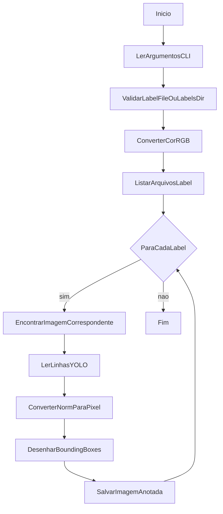
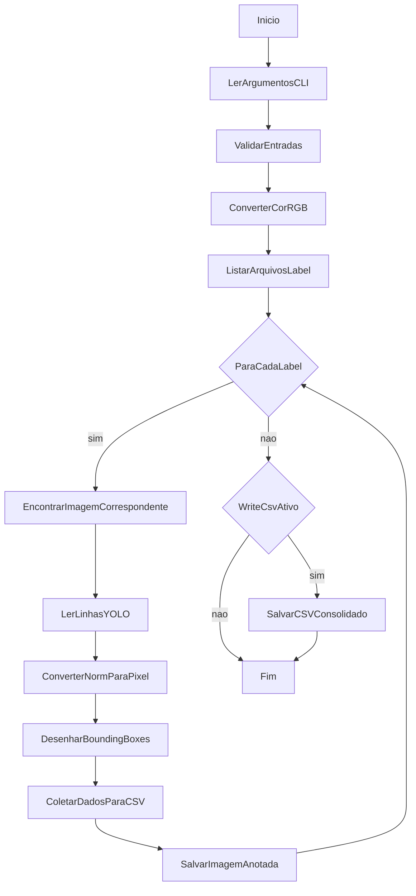
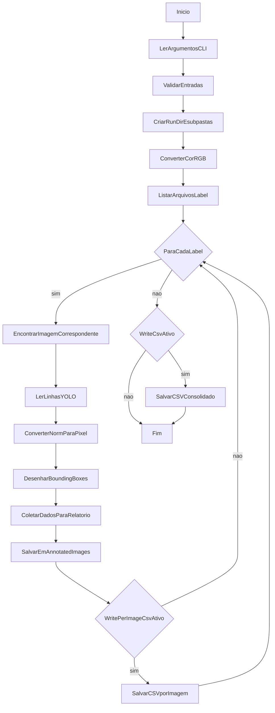

# Diagramas Mermaid - `draw_yolo_boxes_v1.py` (v1, v2, v3)

## v1 - `draw_yolo_boxes_v1.py`

```mermaid
flowchart TD
startV1[Inicio] --> argsV1[LerArgumentosCLI]
argsV1 --> validateV1[ValidarLabelFileOuLabelsDir]
validateV1 --> parseColorV1[ConverterCorRGB]
parseColorV1 --> listLabelsV1[ListarArquivosLabel]
listLabelsV1 --> loopV1{ParaCadaLabel}
loopV1 -->|sim| findImageV1[EncontrarImagemCorrespondente]
findImageV1 --> readLabelV1[LerLinhasYOLO]
readLabelV1 --> convertCoordsV1[ConverterNormParaPixel]
convertCoordsV1 --> drawBoxesV1[DesenharBoundingBoxes]
drawBoxesV1 --> saveImageV1[SalvarImagemAnotada]
saveImageV1 --> loopV1
loopV1 -->|nao| endV1[Fim]
```

## v2 - `draw_yolo_boxes_v2.py`

```mermaid
flowchart TD
startV2[Inicio] --> argsV2[LerArgumentosCLI]
argsV2 --> validateV2[ValidarEntradas]
validateV2 --> parseColorV2[ConverterCorRGB]
parseColorV2 --> listLabelsV2[ListarArquivosLabel]
listLabelsV2 --> loopV2{ParaCadaLabel}
loopV2 -->|sim| findImageV2[EncontrarImagemCorrespondente]
findImageV2 --> readLabelV2[LerLinhasYOLO]
readLabelV2 --> convertCoordsV2[ConverterNormParaPixel]
convertCoordsV2 --> drawBoxesV2[DesenharBoundingBoxes]
drawBoxesV2 --> collectRowsV2[ColetarDadosParaCSV]
collectRowsV2 --> saveImageV2[SalvarImagemAnotada]
saveImageV2 --> loopV2
loopV2 -->|nao| csvCheckV2{WriteCsvAtivo}
csvCheckV2 -->|sim| saveCsvV2[SalvarCSVConsolidado]
csvCheckV2 -->|nao| endV2[Fim]
saveCsvV2 --> endV2[Fim]
```

## v3 - `draw_yolo_boxes_v3.py`

```mermaid
flowchart TD
startV3[Inicio] --> argsV3[LerArgumentosCLI]
argsV3 --> validateV3[ValidarEntradas]
validateV3 --> buildDirsV3[CriarRunDirEsubpastas]
buildDirsV3 --> parseColorV3[ConverterCorRGB]
parseColorV3 --> listLabelsV3[ListarArquivosLabel]
listLabelsV3 --> loopV3{ParaCadaLabel}
loopV3 -->|sim| findImageV3[EncontrarImagemCorrespondente]
findImageV3 --> readLabelV3[LerLinhasYOLO]
readLabelV3 --> convertCoordsV3[ConverterNormParaPixel]
convertCoordsV3 --> drawBoxesV3[DesenharBoundingBoxes]
drawBoxesV3 --> collectRowsV3[ColetarDadosParaRelatorio]
collectRowsV3 --> saveImageV3[SalvarEmAnnotatedImages]
saveImageV3 --> perImageCsvCheckV3{WritePerImageCsvAtivo}
perImageCsvCheckV3 -->|sim| savePerImageCsvV3[SalvarCSVporImagem]
perImageCsvCheckV3 -->|nao| loopV3
savePerImageCsvV3 --> loopV3
loopV3 -->|nao| consolidatedCsvCheckV3{WriteCsvAtivo}
consolidatedCsvCheckV3 -->|sim| saveConsolidatedCsvV3[SalvarCSVConsolidado]
consolidatedCsvCheckV3 -->|nao| endV3[Fim]
saveConsolidatedCsvV3 --> endV3[Fim]
```

